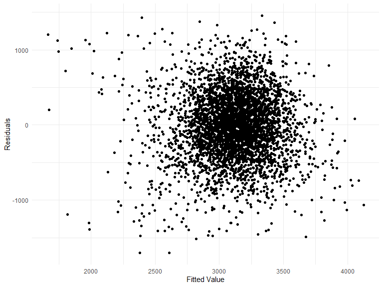
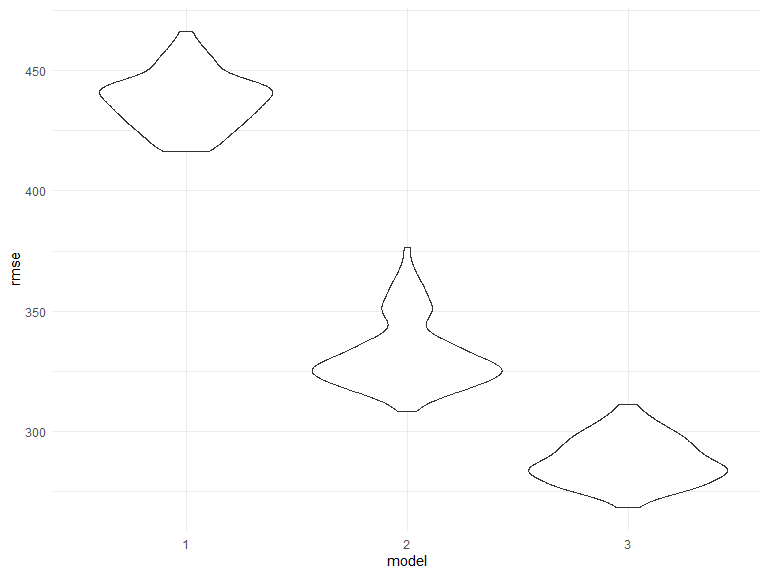
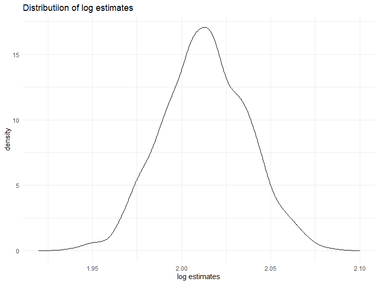
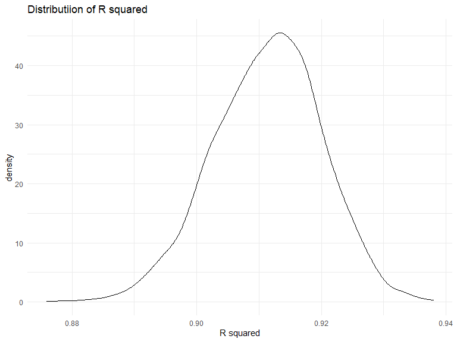

P8105 HW6
================
Elaine Xu
12/5/2020

## Problem 1

``` r
homicide_df = 
  read_csv("data/homicide-data.csv", na = c("", "NA", "Unknown")) %>% 
  mutate(
    city_state = str_c(city, state, sep = ", "),
    victim_age = as.numeric(victim_age),
    resolution = case_when(
      disposition == "Closed without arrest" ~ 0,
      disposition == "Open/No arrest"        ~ 0,
      disposition == "Closed by arrest"      ~ 1)
  ) %>% 
  filter(
    victim_race %in% c("White", "Black"),
    city_state != "Tulsa, AL") %>% 
  select(city_state, resolution, victim_age, victim_race, victim_sex)
```

Start with one city.

``` r
baltimore_df =
  homicide_df %>% 
  filter(city_state == "Baltimore, MD")
glm(resolution ~ victim_age + victim_race + victim_sex, 
    data = baltimore_df,
    family = binomial()) %>% 
  broom::tidy() %>% 
  mutate(
    OR = exp(estimate),
    CI_lower = exp(estimate - 1.96 * std.error),
    CI_upper = exp(estimate + 1.96 * std.error)
  ) %>% 
  select(term, OR, starts_with("CI")) %>% 
  knitr::kable(digits = 3)
```

| term              |    OR | CI\_lower | CI\_upper |
| :---------------- | ----: | --------: | --------: |
| (Intercept)       | 1.363 |     0.975 |     1.907 |
| victim\_age       | 0.993 |     0.987 |     1.000 |
| victim\_raceWhite | 2.320 |     1.648 |     3.268 |
| victim\_sexMale   | 0.426 |     0.325 |     0.558 |

Try this across cities.

``` r
models_results_df = 
  homicide_df %>% 
  nest(data = -city_state) %>% 
  mutate(
    models = 
      map(.x = data, ~glm(resolution ~ victim_age + victim_race + victim_sex, data = .x, family = binomial())),
    results = map(models, broom::tidy)
  ) %>% 
  select(city_state, results) %>% 
  unnest(results) %>% 
  mutate(
    OR = exp(estimate),
    CI_lower = exp(estimate - 1.96 * std.error),
    CI_upper = exp(estimate + 1.96 * std.error)
  ) %>% 
  select(city_state, term, OR, starts_with("CI")) 
```

``` r
models_results_df %>% 
  filter(term == "victim_sexMale") %>% 
  mutate(city_state = fct_reorder(city_state, OR)) %>% 
  ggplot(aes(x = city_state, y = OR)) + 
  geom_point() + 
  geom_errorbar(aes(ymin = CI_lower, ymax = CI_upper)) + 
  theme(axis.text.x = element_text(angle = 90, hjust = 1))
```


## Problem 2

``` r
birthw = read_csv("./data/birthweight.csv") %>%
  janitor::clean_names() %>%
  mutate(
    babysex = factor(babysex),
    frace = factor(frace),
    mrace = factor(mrace),
    malform = factor(malform)
  )

sum(is.na(birthw))
```

    ## [1] 0

#### fit a model for birth weight

I use Stepwise regression to find the variables that are most fit in the
model.

``` r
mult.fit <- lm(bwt ~ ., data=birthw)
step(mult.fit, direction='backward')
```

From the test result above, I got my model:

``` r
model_fit1 = lm(bwt ~ babysex + bhead + blength + delwt + fincome + gaweeks + 
    mheight + mrace + parity + ppwt + smoken, data = birthw
)
summary(model_fit1)
```

    ## 
    ## Call:
    ## lm(formula = bwt ~ babysex + bhead + blength + delwt + fincome + 
    ##     gaweeks + mheight + mrace + parity + ppwt + smoken, data = birthw)
    ## 
    ## Residuals:
    ##      Min       1Q   Median       3Q      Max 
    ## -1097.18  -185.52    -3.39   174.14  2353.44 
    ## 
    ## Coefficients:
    ##               Estimate Std. Error t value Pr(>|t|)    
    ## (Intercept) -6098.8219   137.5463 -44.340  < 2e-16 ***
    ## babysex2       28.5580     8.4549   3.378 0.000737 ***
    ## bhead         130.7770     3.4466  37.944  < 2e-16 ***
    ## blength        74.9471     2.0190  37.120  < 2e-16 ***
    ## delwt           4.1067     0.3921  10.475  < 2e-16 ***
    ## fincome         0.3180     0.1747   1.820 0.068844 .  
    ## gaweeks        11.5925     1.4621   7.929 2.79e-15 ***
    ## mheight         6.5940     1.7849   3.694 0.000223 ***
    ## mrace2       -138.7925     9.9071 -14.009  < 2e-16 ***
    ## mrace3        -74.8868    42.3146  -1.770 0.076837 .  
    ## mrace4       -100.6781    19.3247  -5.210 1.98e-07 ***
    ## parity         96.3047    40.3362   2.388 0.017004 *  
    ## ppwt           -2.6756     0.4274  -6.261 4.20e-10 ***
    ## smoken         -4.8434     0.5856  -8.271  < 2e-16 ***
    ## ---
    ## Signif. codes:  0 '***' 0.001 '**' 0.01 '*' 0.05 '.' 0.1 ' ' 1
    ## 
    ## Residual standard error: 272.3 on 4328 degrees of freedom
    ## Multiple R-squared:  0.7181, Adjusted R-squared:  0.7173 
    ## F-statistic: 848.1 on 13 and 4328 DF,  p-value: < 2.2e-16

After looking at the summary, I found out the p-value of `fincome` is
greater than 0.05, and p-value of one of the `mrace` is also not
significant. So I drop these two variables from my model. From the
description, I think `bhead` and `blength` may overlap with `bwt`, so I
dropped these two variables. After drop these three variables, `parity`
becomes not significant, so I drop this variable too. Rebuild the model.

``` r
model_fit1 = lm(bwt ~ babysex + delwt + gaweeks + 
    mheight + ppwt + smoken, data = birthw)
summary(model_fit1)
```

    ## 
    ## Call:
    ## lm(formula = bwt ~ babysex + delwt + gaweeks + mheight + ppwt + 
    ##     smoken, data = birthw)
    ## 
    ## Residuals:
    ##      Min       1Q   Median       3Q      Max 
    ## -1702.74  -266.91     7.91   283.63  1457.26 
    ## 
    ## Coefficients:
    ##               Estimate Std. Error t value Pr(>|t|)    
    ## (Intercept) -1170.5228   179.1144  -6.535 7.09e-11 ***
    ## babysex2      -94.0294    13.3610  -7.038 2.26e-12 ***
    ## delwt           9.1977     0.6212  14.807  < 2e-16 ***
    ## gaweeks        60.8016     2.1456  28.338  < 2e-16 ***
    ## mheight        21.1320     2.7918   7.569 4.56e-14 ***
    ## ppwt           -5.7976     0.6856  -8.456  < 2e-16 ***
    ## smoken         -7.5321     0.9033  -8.339  < 2e-16 ***
    ## ---
    ## Signif. codes:  0 '***' 0.001 '**' 0.01 '*' 0.05 '.' 0.1 ' ' 1
    ## 
    ## Residual standard error: 439.5 on 4335 degrees of freedom
    ## Multiple R-squared:  0.2647, Adjusted R-squared:  0.2637 
    ## F-statistic: 260.1 on 6 and 4335 DF,  p-value: < 2.2e-16

plot of model residuals against fitted values:

``` r
birthw %>%
  add_residuals(model_fit1) %>%
  add_predictions(model_fit1) %>%
  ggplot(aes(x = pred, y = resid)) + geom_point() +
  labs(x = "Fitted Value",
       y = "Residuals")
```


From the plot we cannot really see an obvious relation between the
predictor and residuals.

#### Compare your model to two others

One using length at birth and gestational age as predictors (main
effects only)

``` r
model_fit2 = lm(bwt ~ blength + gaweeks, data = birthw)
```

One using head circumference, length, sex, and all interactions
(including the three-way interaction) between these

``` r
model_fit3 = lm(bwt ~ blength + bhead + babysex + blength*bhead + blength* babysex + bhead*babysex + blength*bhead*babysex, data = birthw)
```

Cross validation:

``` r
cv_df = 
  crossv_mc(birthw, 100) %>% 
    mutate(
        train = map(train, as.tibble),
        test = map(test,as.tibble)
    )  %>%
  mutate(
    model_fit  = map(train, ~lm(bwt ~ babysex + delwt + gaweeks + 
    mheight + ppwt + smoken, data = birthw)),
    model_fit2  = map(train, ~lm(bwt ~ blength + gaweeks, data = birthw)),
    model_fit3  = map(train, ~lm(bwt ~ blength + bhead + babysex + blength*bhead + blength* babysex + bhead*babysex + blength*bhead*babysex, data = birthw))) %>% 
  mutate(
    rmse_1 = map2_dbl(model_fit, test, ~rmse(model = .x, data = .y)),
    rmse_2 = map2_dbl(model_fit2 , test, ~rmse(model = .x, data = .y)),
    rmse_3 = map2_dbl(model_fit3, test, ~rmse(model = .x, data = .y))) 
```

``` r
cv_df %>% 
  select(starts_with("rmse")) %>% 
  pivot_longer(
    everything(),
    names_to = "model", 
    values_to = "rmse",
    names_prefix = "rmse_") %>% 
  mutate(model = fct_inorder(model)) %>% 
  ggplot(aes(x = model, y = rmse)) + geom_violin()
```


From the violin plot we can see that the model I made has the highest
rmse value, which means the prediction accuracy for this model is too
low to be used as a linear model. Model 3 has the lowest rmse, which is
the model contains the interaction term. I would select model 3 with the
interaction term to be my model.

## Problem 3

``` r
weather_df = 
  rnoaa::meteo_pull_monitors(
    c("USW00094728"),
    var = c("PRCP", "TMIN", "TMAX"), 
    date_min = "2017-01-01",
    date_max = "2017-12-31") %>%
  mutate(
    name = recode(id, USW00094728 = "CentralPark_NY"),
    tmin = tmin / 10,
    tmax = tmax / 10) %>%
  select(name, id, everything())
```

log estimate

``` r
boots_wt = weather_df %>% 
  modelr::bootstrap(n = 5000) %>% 
  mutate(
    models = map(strap, ~lm(tmax ~ tmin, data = .x) ),
    rsquare = map(models, broom::glance),
    results = map(models, broom::tidy)) %>% 
  select(-strap, -models) %>% 
  unnest(rsquare, results) %>% 
  select(term,estimate, r.squared) %>%
  mutate(
    term = str_replace(term, "\\(Intercept\\)","Intercept")
  ) %>%
  pivot_wider(
    names_from = term,
    values_from = estimate
  ) %>%
  mutate(
    log = log(Intercept*tmin)
  ) %>%
  select(r.squared, log)
```

plot log estimate

``` r
boots_wt %>%
  summarise(mean = mean(log),
            lower = quantile(log,0.025),
            upper = quantile(log, 0.975))
```

    ## # A tibble: 1 x 3
    ##    mean lower upper
    ##   <dbl> <dbl> <dbl>
    ## 1  2.01  1.97  2.06

``` r
boots_wt %>%
  ggplot(aes(x = log)) + geom_density() + labs(title = "Distributiion of log estimates", x = "log estimates")
```


From the graph we can see that the log estimates is following a normal
distribution, where the mean is 2.01, between 2.00 and 2.025. The 95%
confidence interval for log estimates is (1.965, 2.058)

plot R squared

``` r
boots_wt %>%
  summarise(mean = mean(r.squared),
            lower = quantile(r.squared,0.025),
            upper = quantile(r.squared, 0.975))
```

    ## # A tibble: 1 x 3
    ##    mean lower upper
    ##   <dbl> <dbl> <dbl>
    ## 1 0.911 0.893 0.928

``` r
boots_wt %>%
  ggplot(aes(x = r.squared)) + geom_density() + labs(title = "Distributiion of R squared", x = "R squared")
```


From the graph we can also see that r squared is normally distributed
where th mean is 0.911, between 0.91 and 0.92. The 95% confidence
interval for r squared is (0.894, 0.928)
